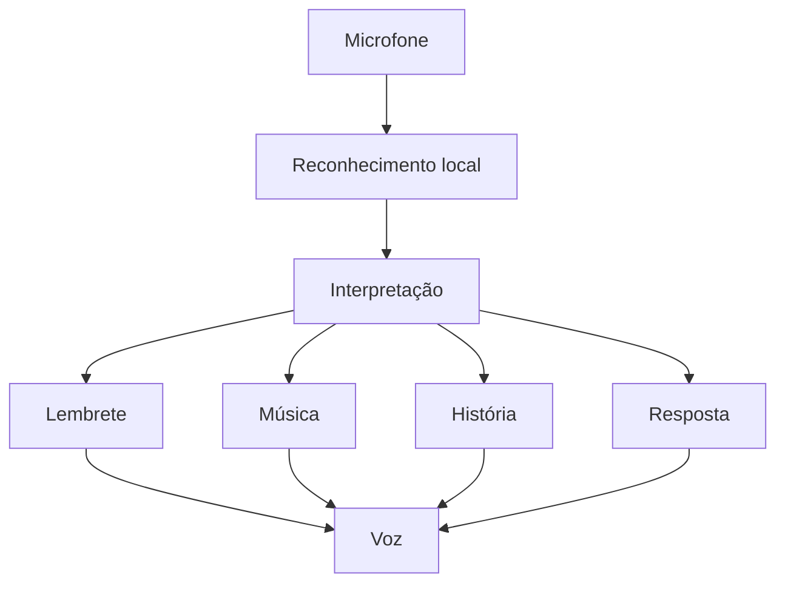
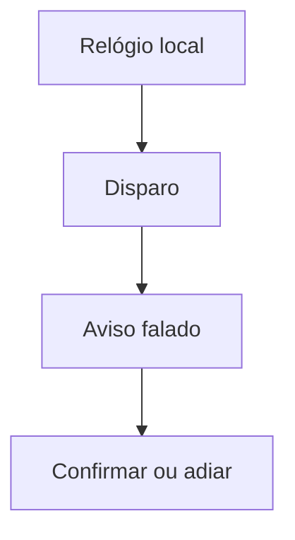

# Etapa 1 — análise e síntese do sistema

**Até:** 08/01/2027 (1.º relatório intercalar)  
**Data:** 2026-10-09

Análise do sistema que a etapa 1 demonstra em janeiro. O calendário geral continua em [`docs/PLANEAMENTO.md`](PLANEAMENTO.md).

## 1. Identificação

| | |
|---|---|
| Projeto | RIC — Robô Interativo Companheiro |
| Etapa | 1, até 08/01/2027 |
| Aluno | Pedro Albuquerque |
| Turma | 3-TIS |

Até 23/10/2026 só se planifica. O código desta etapa começa depois dessa data.

## 2. Situação atual

O que o protótipo já faz, em 2026-10-09:

- Chat local com Ollama (`qwen2.5:3b`) e ferramentas de lembretes e música.
- Lembretes que se criam, disparam, confirmam e adiam. O disparo não usa o modelo nem a Internet. Cada lembrete dispara uma vez: a repetição diária ainda não está feita.
- TTS no Windows (SAPI). É voz de sistema.
- STT no browser (Web Speech API). No Chrome o áudio segue para um serviço da Google. Não funciona sem Internet e não serve de base a esta etapa.
- Leitor de música offline em `ric/musica/`, com pastas de géneros, pausa, continuar, recomeçar e volume.
- História curta quando a pessoa a pede ao modelo. Não há ficheiros de histórias guardadas.

## 3. Situação pretendida até janeiro

Até 08/01/2027 a pessoa conversa com o RIC em fala, em português de Portugal.

Pede um lembrete em fala livre, incluindo o remédio todos os dias à mesma hora. O aviso sai falado. Depois de disparar ou de ser confirmado, o lembrete diário volta a armar-se para o dia seguinte.

Pede uma música da biblioteca local e o RIC toca-a. O conjunto é pequeno: faixas do Pedro ou livres de direitos, em duas ou três pastas de género.

Pede uma história e o RIC conta uma curta do modelo. Lê também um texto de um conjunto de 3 a 5 histórias curtas, escritas para o projeto e guardadas no robô.

## 4. Atores

| Ator | Papel nesta etapa |
|---|---|
| A pessoa | Fala com o RIC e usa botões ou texto quando a voz falha |
| O RIC | Ouve, fala e dispara os lembretes |
| O modelo local | Só entra na conversa, no pedido de música e na história |

Os auxiliares de saúde e o BackOffice ficam fora desta etapa.

O disparo, a confirmação e o adiamento do lembrete não passam pelo modelo. O pedido falado de criar um lembrete segue o chat que já existe.

## 5. Requisitos funcionais

Só o que entra agora.

- **RF1.** Conversar em português de Portugal, em fala livre, sem uma lista de comandos, e responder em voz.
- **RF2.** Criar um lembrete de várias maneiras, em fala livre. Inclui o remédio todos os dias à mesma hora. Esse lembrete diário volta a armar-se para o dia seguinte depois de disparar ou de ser confirmado.
- **RF3.** Disparar, confirmar e adiar sem o modelo e sem Internet. O aviso sai falado. Confirmar («já tomei») e adiar também por voz.
- **RF4.** Tocar, por pedido falado, uma música que está na biblioteca local.
- **RF5.** Contar uma história curta do modelo e ler, em voz, uma história do conjunto guardado.
- **RF6.** Manter botões grandes e texto no ecrã como apoio quando o reconhecimento falha ou quando a pessoa ouve mal.

## 6. Requisitos de qualidade

- As funções essenciais de lembrete funcionam offline: disparo, confirmação e adiamento não dependem do modelo nem da Internet. Música e histórias guardadas estão no PC. A conversa e a história do modelo usam o Ollama local.
- Privacidade local: os dados desta etapa ficam no PC. Nada segue para a nuvem.
- O RIC não diagnostica nem prescreve. Lembra e regista.

Três pontos ficam em **proposta**. O Pedro ainda não os fechou:

- Respostas curtas, de 2 a 4 frases.
- Uma só voz em português de Portugal.
- Nesta etapa o RIC não é interrompido a meio da frase. Acaba a frase.

## 7. Fluxos

### Pedido falado

O microfone recebe a fala. O reconhecimento é local. A interpretação escolhe uma ação: lembrete, música, história ou resposta. A ação devolve voz. Na música, a ação é tocar a faixa.

De cada pedido segue uma destas ações, não as quatro ao mesmo tempo.

### Disparo do lembrete

Este fluxo é à parte. Não passa pelo modelo nem pela Internet. O relógio local dispara o aviso falado. A pessoa confirma ou adia. No lembrete diário, o RIC volta a armá-lo para o dia seguinte.

## 8. Dados desta etapa

Tudo fica no PC. Nada sai para a nuvem.

| Dado | Nesta etapa |
|---|---|
| Lembretes | Com repetição diária. Hoje disparam uma vez; a repetição entra até janeiro |
| Perfil | O que o chat local já guarda da pessoa |
| Histórico recente de conversa | Memória curta do diálogo no PC |
| Ficheiros de música | Biblioteca local em `ric/musica/` |
| Textos de histórias | 3 a 5 textos curtos guardados. Ainda não existem ficheiros |

## 9. Síntese da voz

O modo de voz do ChatGPT é a referência de experiência. A tecnologia não entra: essa voz é um sintetizador na nuvem. Em janeiro o RIC fala offline, com uma voz compreensível em português de Portugal.

**Falar.** O SAPI já funciona. O estudo vê que vozes de português de Portugal estão no Windows e se uma voz offline melhor se ouve melhor — por exemplo Piper, se houver voz pt-PT e o PC aguentar com o Ollama ligado. Trocar de voz ao longo da conversa fica fora desta etapa.

**Ouvir.** O reconhecimento do browser deixa de ser a solução. Envia áudio para fora. No PC do Pedro comparam-se duas vias locais:

- um modelo leve, Vosk com modelo de português;
- um modelo mais pesado, Whisper em local, se o PC ainda tiver folga com o Ollama a correr.

Fica a via que perceber frases em português de Portugal, com o Ollama ligado e sem Internet. Se nenhuma for estável, o 1.º relatório diz a falha. O texto e o botão de falar ficam como apoio.

A resposta curta, a voz única e o não interromper a meio continuam proposta, como na secção 6.

## 10. Fronteira do sistema

Não entram nesta etapa:

| Fora | Quando |
|---|---|
| Agenda com dia, consultas e compromissos | Etapa 2 |
| Leitura de livros, música de ambiente e vozes de personagens | Etapa 2 |
| Recomendações, meteorologia e notícias | Etapa 3 |
| BackOffice e lembretes já postos na entrega | Fora das etapas; o foco é o RIC |
| Biblioteca grande gerida pelo gosto da pessoa | Ideia posterior |
| Busca de músicas na nuvem | Ideia posterior |
| Guardar automaticamente as histórias novas | Ideia posterior. A história curta do modelo, dita na hora, mantém-se |

## 11. Critérios de aceite

- Dez frases diferentes criam ou consultam um lembrete, sem um comando único obrigatório.
- Um lembrete diário dispara em voz dois dias seguidos, com a rede desligada e o Ollama parado.
- Uma música local toca a partir de um pedido falado.
- Uma história guardada é lida em voz, e uma história curta do modelo também, com o Ollama ligado e sem Internet.
